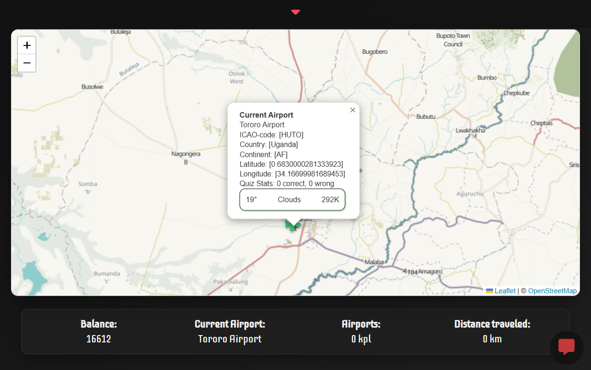
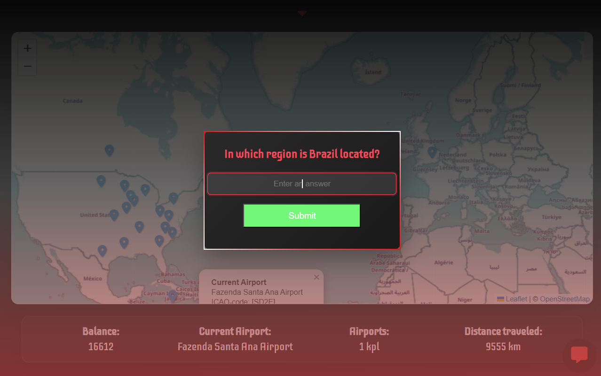
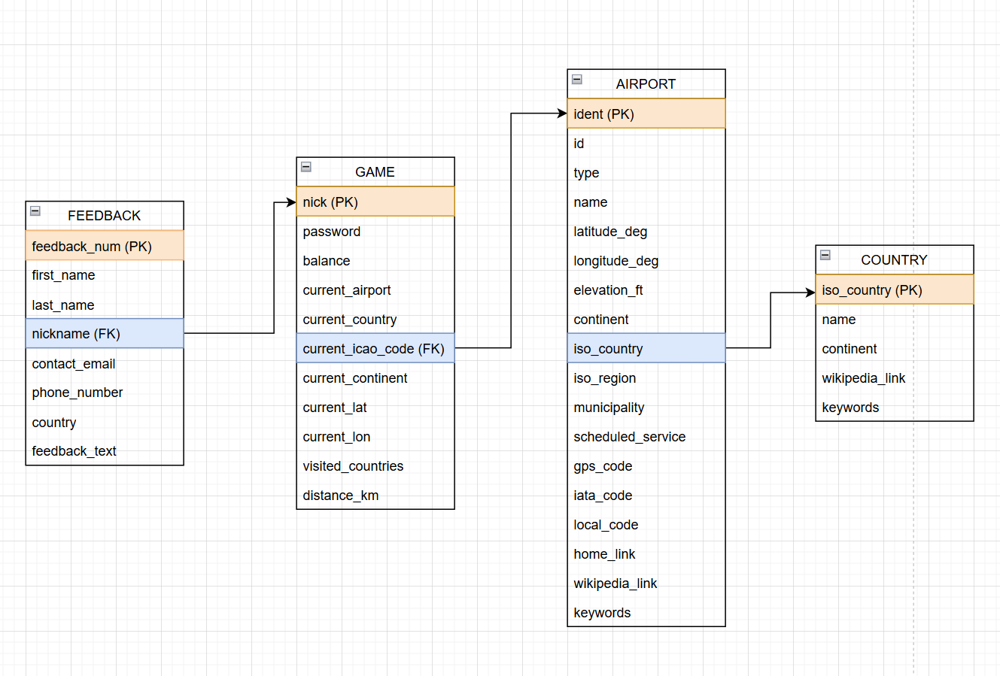

# Browser-Based Flight Game

## Overview

A full stack browser-based flight game where the player travels between airports, answers location-based questions, and earns in-game currency. The game integrates external REST APIs to provide real-time data and dynamic gameplay.

The objective is to reach **30,000 T** by traveling and correctly answering questions related to the player’s current location.

> **Note:** The game is implemented in **Finnish**.

---

## Demo

### Gameplay
<div align="center">
  
  
</div>

### Database Structure
<div align="center">
  
</div>

---

## My Contributions
- Acted as team lead, coordinating development tasks and distributing responsibilities across the team 
- Designed and implemented a class-based Python backend using Flask  
- Developed REST API endpoints for game logic and data handling  
- Implemented user authentication with secure password hashing  
- Designed and structured the relational database and ensured data consistency  
- Integrated external APIs (OpenWeatherMap, REST Countries) into gameplay logic  
- Developed dynamic frontend functionality using JavaScript and AJAX  
- Implemented game logic including scoring system and game progression 

---

## Key Features

* Full stack architecture (Python backend + browser frontend)
* REST API integration for real-time data
* Location-based gameplay using real-world data
* User authentication and persistent game state
* Dynamic UI using JavaScript and AJAX
* Interactive map visualization using Leaflet

---

## External APIs & Map Integration

* **OpenWeatherMap API**
  → Provides real-time weather data based on player location

* **REST Countries API**
  → Provides country-related data and generates questions

* **Leaflet.js**
  → Used to render interactive maps and display player location

---

## Game Logic

* Player starts with a **random amount of money**
* Player travels between airports
* Questions are generated based on the current location
* Correct answer: **+1250 T**
* Wrong answer: **–1000 T**
* The goal is to reach **30,000 T**

---

## Game Features

* **Load Game:**
  Continue a previous session by logging in with existing credentials

* **Save & Quit:**
  Press `ESC` → select **Save & Quit** to store progress

* **Persistent gameplay:**
  Game progress can be continued across sessions

* **Feedback system:**
  Accessible via dropdown menu (red arrow in UI)
  → Users can submit feedback through a form

---

## Architecture

The system consists of:

* **Backend (Python / Flask)**

  * Handles game logic and REST API endpoints
  * Communicates with external APIs
  * Manages database operations

* **Frontend (HTML, CSS, JavaScript)**

  * Browser-based UI
  * Uses AJAX for dynamic updates
  * Integrates Leaflet for map visualization

* **Database (MySQL)**

  * Stores user data, progress, and game state

---

## Backend Structure

The backend follows an object-oriented design:

* A base class **SqlConnection** manages database connectivity
* Other classes inherit from this base class
* Ensures modular and reusable database operations

---

## Technologies

* Python (Flask)
* SQL (MySQL)
* JavaScript (AJAX)
* HTML & CSS
* Leaflet.js
* REST APIs
* OpenWeatherMap API
* REST Countries API

---

## Setup & Run

### 1. Clone the repository

```bash
git clone https://github.com/susisami/your-repo.git
cd your-repo
```

---

### 2. Install dependencies

Make sure you have **Python 3.13 or newer** installed.

```bash
pip install -r requirements.txt
```

---

### 3. Setup database

* Install and configure a **MySQL database**
* Import required tables (see project structure / SQL files)
* Ensure database credentials match your backend configuration

---

### 4. Start backend server

Run the backend:

```bash
python game.py
```

You should see:

```
Running on http://127.0.0.1:5000
```

---

### 5. Launch frontend

* Navigate to:

```id="runpath"
src > frontend > index.html
```

* Right-click → **Open with Live Server**

👉 The game will open in your browser.

---

## Database

The application uses a relational database consisting of:

* Game (player data and progress)
* Airport (location data)
* Country (country data)
* Feedback (user feedback system)

---

## Future Improvements

* Enhanced UI/UX design
* More diverse question system
* Expanded gameplay mechanics
* Improved data visualization

---

## Author

Sami Souci
