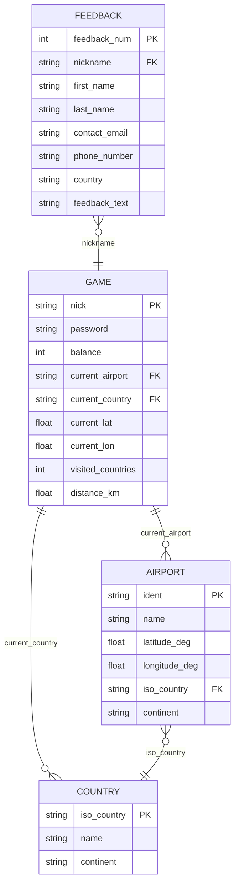

# Browser-Based Flight Game

## Overview
A full stack browser-based flight game featuring a Python backend, REST APIs, and an interactive frontend. The application simulates gameplay mechanics while handling user data and game logic through a structured backend.

## Demo / Preview
## Database Structure

## Key Features
- Full stack architecture with Python backend and browser-based frontend  
- REST API for communication between client and server  
- User authentication with credential encryption  
- Dynamic frontend using JavaScript and AJAX  
- Database integration for persistent game data  

## My Contributions
- Designed and implemented class-based Python backend using Flask  
- Developed REST API endpoints for game logic and data handling  
- Implemented user authentication and credential encryption  
- Designed database structure and ensured data consistency  
- Contributed to frontend development (AJAX, UI functionality)  

## Technologies
- Python (Flask)  
- SQL  
- JavaScript  
- HTML & CSS  
- AJAX  
- OpenStreetMap API  

## Architecture
The system consists of:
- Backend server (Flask) handling game logic and APIs  
- Frontend interface running in the browser  
- Database for storing user and game data  

## How It Works
1. User interacts with the browser-based UI  
2. Frontend sends requests via AJAX  
3. Backend processes logic and communicates with database  
4. Data is returned and dynamically rendered in the UI

## Setup & Run

